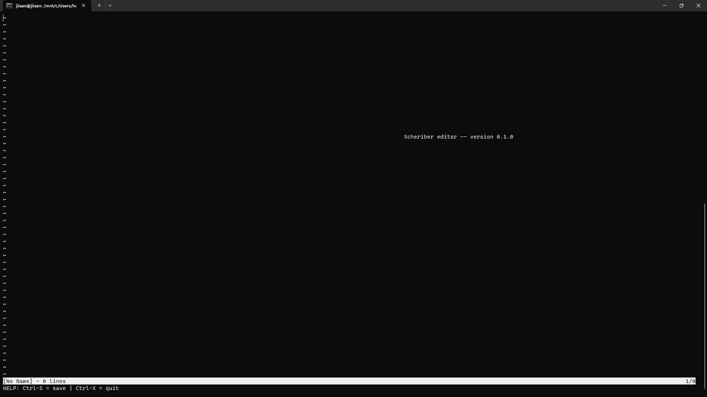
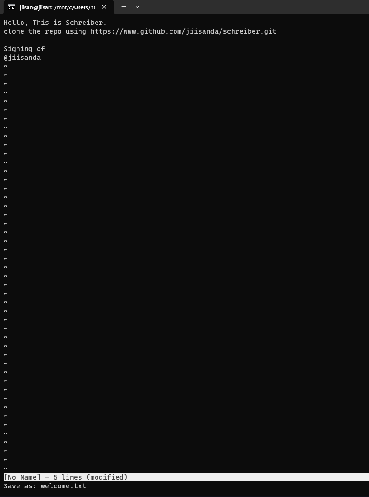
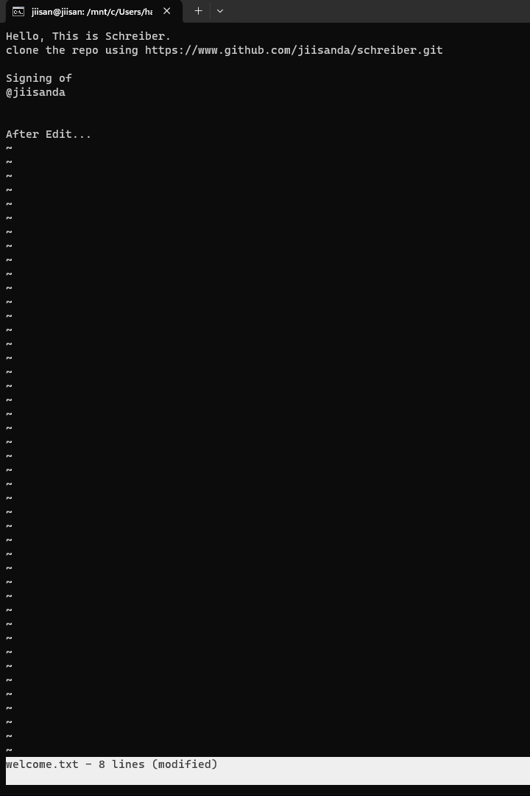

# Schreiber

A simple Text Editor, build using Rust.

## Features

For now can do everything a normal wordpad/notepad can do.

## Installation

Schreiber uses `termion`, which is designed to work on Unix-like system, including Linux and macOS.
So to work on windows we will be using `wsl`.

### Setup WSL

Instruction to install [WSL](https://docs.microsoft.com/en-us/windows/wsl/install-win10)

### Setup Rust

If you don't already have Rust installed, you can install it by following the instructions at 
[https://www.rust-lang.org/tools/install](https://www.rust-lang.org/tools/install).

### Clone the repository

```command line
git clone https://github.com/jiisanda/schreiber.git
```

### Build and Run the Project

After cloning the repository and installing Rust, you can build and run the project using Cargo, Rust's package manager
and build system. Navigate to the project directory in your terminal and run:

```command line
$ cargo build

$ cargo run
```

This will compile the project and run it. If you make changes to the code, you can recompile it by running `cargo build` 
again.

## Usage | Demo

1) Window Screen
  Output of `cargo run`
  
2) Saving a file
  `Ctrl-S`, after writing to a file...
  
3) Editing a file

  For opening a file run `cargo run <filename>`. In our case\

  ```command line
   cargo run welcome.txt
  ```

  

  Notice how at the bottom, schreiber shows it is modified.
  If modified file is exited without saving, it asks for pressing `Ctrl-X` 3 times, to ensure you surly don't want to
  save changes.
